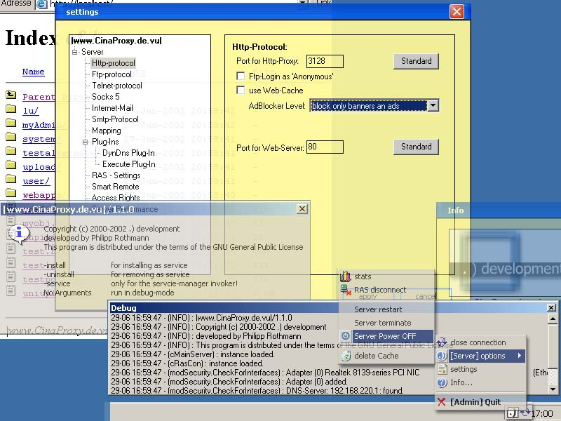



## Open Source Proxy Server \(vb6\),nt\-service,http\(s\),ftp,telnet,ssl,ras  \(cinaproxy\) w9x/me/nt/2k/xp

### Description

Complete proxy solution(source,docs) 1 connection to the internet and even more pc's in your lan that want to connect,too?: http-proxy, web-server (php-support,XML-support,dir),socks4/5,smtp relay, telnet-port-mapping, internet-mail support,remote admin via Crypto API, atomic syncer (uses settings from system), dyndns updater and many many more (full details see below) techniques used: winsock.ocx, crypto api, msxml, Java, rasapi,

ip-blocking,iphelper-api, own secure-socket layer, user-behavior, use as local adblock proxy, auto disconnect auto reconnect, flatrate support, RAS-Manager (also usable without proxy), http-logging and other protocols, fully customizable (YOU can modify the source), web-server for intranet (also usable for anti-virus pattern-files that has to be distributed via lan), collect your anti-virus-pattern-files on connect via ras, set your dynamic dy..dns ip,set online state....

more stable, more config, less errors

the cina proxy is a multifunctional proxy project completly written in vb6. project life time more than 2 years. good combination of techniques and algorithms shown in serveral other projects that have same aims. the project is just a tutorial how to design a smart proxy for your lan. it is not a solution, but it can solve serveral problems that might not sell your firewall. This project is just in alpha release phase, but if you are interested in proxy programming send your feedback and vote.Please vote and give feedback if this is the tool youa re looking for. it is not NAT or a firewall, but can be used beside ones.

-->service under 9x/Me/Nt/XP/2k

see Documentation at website...
 
### More Info
 

             |
---                |---
**Submitted On**   |
**By**             |[preneco](https://github.com/Planet-Source-Code/PSCIndex/blob/master/ByAuthor/preneco.md)
**Level**          |Advanced
**User Rating**    |4.9 (89 globes from 18 users)
**Compatibility**  |VB 6\.0
**Category**       |[Complete Applications](https://github.com/Planet-Source-Code/PSCIndex/blob/master/ByCategory/complete-applications__1-27.md)
**World**          |[Visual Basic](https://github.com/Planet-Source-Code/PSCIndex/blob/master/ByWorld/visual-basic.md)
**Archive File**   |

### Source Code

<html><body>

<a href="http://prdownloads.sourceforge.net/cinaproxy/cinaproxy_win32_src.zip?download"><b></b></a><b><a href="http://prdownloads.sourceforge.net/cinaproxy/cinaproxy_win32_src.zip?download" target="_blank">Download new
 Release Stable V05</a></b>

Sorry I couldn't
 upload the source up to Pscode.com 
 so if you want the documentation please visit: <a href='http://www.cinaproxy.de.vu' target="_blank"> 
 <b>Project Home Page</b></a> or <a href='http://sourceforge.net/project/showfiles.php?group_id=45079' target="_blank"><b>Source
 Code and Installer</b></a> 

<b>Using the Cina
 Proxy Server Project</b>

What can you do
 with the code? 
 

<ul>
 <li>it's simple,
 this project and it's subprojects are examples what 
 you can do with the cXPLib Library 
 <ul>
 <li>a simple
 proxy server (Cina) 
 <ul>
 <li>http,https
 (SSL,TSL),ftp 
 <li>adblocker
 (ads, banners, cookies, javascript)
 <li>intelligent
 cache 
 <li>ftp-gateway
 </ul>
 <li>a web server
 
 <ul>
 <li>what
 is cgi under visual basic 
 <li>how
 to integrate php cgi module (php.exe) 
 <li>how
 to integrate java-classes into your server (java.exe) 
 <li>xml
 support (MSXML4, JAVA XERXES)
 </ul>
 <li>a smtp
 server (nslookup dns-server..) 
 <li>a SOCKS4
 and SOCKS5 Server
 <li>a telnet
 gateway
 <li>a multiple
 internet mail gateway (POP/IMAP/SMTP per User)
 <li>smartremote
 server for user-specific behavior of the proxy (level of ad-block, xml
 on/off...) and starting a ras-connection
 <li>flatrate-support
 <li>dynamic
 port-forwarding
 <li>dyndns-support
 <li>atomic
 time syncher for german time (uhrzeit.org)
 <li>executes
 exes on ras-connect (like the silent anti-virus updater of Symantec)
 <li>can shutdown
 the server on demand and if it is not longer used
 <li>time management
 for ras-behavior
 <li>restriction
 and access management per server
 <li>....
 </ul>
 
 

 <li>Tutorial for...
 <ul>
 <li>what can
 Winsock.ocx do within a Visual Basic Application 
 <li>what can't
 Winsock.ocx do and what are problems 
 <li>how can
 i make up a ras-connection (rasapi32.dll) 
 <li>how can
 i dis2connect from lan 
 <li>how can
 i run exes at dial up 
 <li>how can
 i implement a atomic time sync-er 
 <li>how can
 i implement a dyndns-updater 
 <li>how can
 i get the ip-addresses and adapters from my system 
 <li>how can
 i implement a secure socket (MS Crypto Api 2) and layers 
 <li>how can
 i implement a winsock-pool that strikes back incoming requests 
 <li>how can
 i use threads in vb (COM) 
 <li>how can
 i use System-Tray (Admin/GoOnline) 
 <li>how can
 i use transparent forms (bitmap regions on forms that are transparent)
 
 <li>how can
 i skin my apps 
 <li>how can
 i paint on menues 
 <li>how can
 i make a Server-Application 
 <li>how can
 i make a Remote Client Agent 
 <li>how can
 i use zlib zip compression utility 1.1.4 
 <li>how can
 i use res-files and international ressources 
 <li>.... 
 <li>some project
 files from earlier releases (mail: pop2,imap,smtp with filesystem) 
 but not supported any more. 
 </ul>
 <li>why the GPL?
 
 <ul>
 <li>some of
 my modules contain procs that use algos from other talented 
 programmers (from planet-sourcecode.com, sourceforge.net, vbip.com) 
 so i want to give everybody who's interested at hardcore visual basic
 the 
 possibility to check out the code freely. 
  
 i think the gpl is a good alternative to freeware or adware. 
 Also i do not commercially use the compilers and thats the point. 
 
 </ul>
</ul>
</body>
</html>

